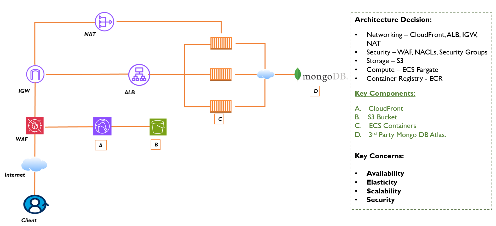
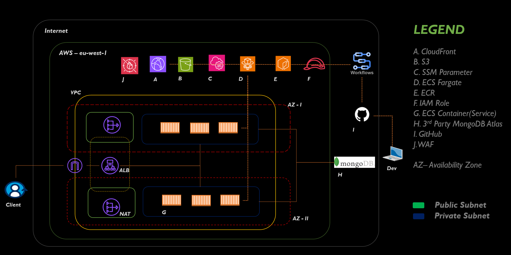
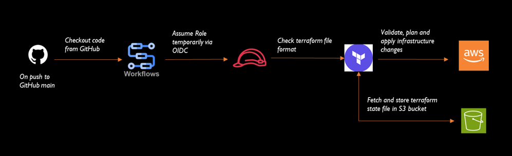
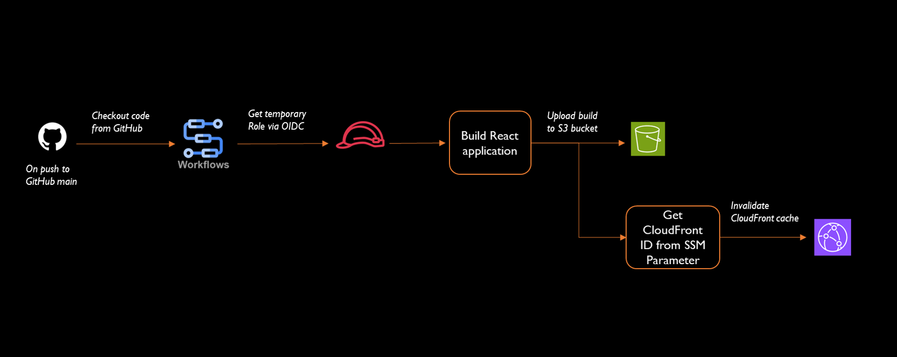
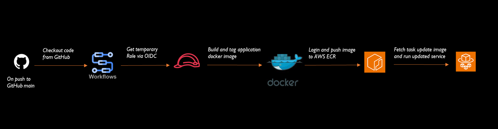

<h1>🛍️ Luxe – Cloud-Native Ecommerce Platform</h1>

Luxe is a cloud-native ecommerce application designed to demonstrate scalable microservices architecture, secure traffic management, and modern cloud deployment practices on AWS. The project focuses on clean infrastructure design, high availability, and production-ready patterns using managed cloud services.

<h2>📌 Project Overview</h2>

Luxe is built as a microservices-based ecommerce platform with a decoupled frontend and backend. The frontend is delivered globally via Amazon CloudFront, while backend services run as containerized workloads on AWS ECS Fargate behind an Application Load Balancer.

The infrastructure is fully provisioned using Terraform, ensuring consistency, repeatability, and easy environment replication.

<h2>🏗️ Architecture Overview</h2>

<h3>High-level design:</h3>

Static frontend hosted on Amazon S3 and distributed via CloudFront

Backend microservices deployed on ECS Fargate

Application Load Balancer for backend traffic routing

AWS WAF protecting both CloudFront and ALB

Infrastructure managed with Terraform

<h3>🔹 Components</h3>
<h5>Frontend</h5>

Static ecommerce frontend

Hosted on Amazon S3

Distributed globally using Amazon CloudFront

Optimized for performance and low latency

<h5>Backend Services</h5>

Microservices architecture

Containerized services running on AWS ECS Fargate

Stateless services for horizontal scalability

Deployed behind an Application Load Balancer

Application Load Balancer

Routes incoming requests to backend services

Performs health checks

Enables service-level scalability and fault tolerance

Web Application Firewall (WAF)

Attached to both CloudFront and ALB

Uses AWS Managed Rule Groups

Implements IP-based rate limiting

Provides protection against common web exploits

<h5>Infrastructure as Code</h5>

All resources provisioned using Terraform

Modular and reusable infrastructure components

Enables consistent deployments across environments

<h2>🔐 Security Design</h2>

Backend services are not directly exposed to the internet

All inbound traffic is filtered through WAF

Rate limiting to prevent abuse

Managed rule sets for common attack patterns

Separation of frontend delivery and backend processing

<h3>🛠️ Technology Stack</h3>

<h5>Frontend</h5>

Amazon S3

Amazon CloudFront

<h5>Backend</h5>

Containerized microservices

AWS ECS Fargate

Application Load Balancer

<h5>Security</h5>

AWS WAF (Managed Rules + Rate Limiting)

<h5>Infrastructure</h5>

Terraform

AWS VPC and networking components

<h2>Data Flow Diagram</h2>

<h2>Network Diagram<h2>

<h3>🚀 Key Features & Highlights</h3>

Microservices-based backend architecture

Serverless container deployment with ECS Fargate

Global content delivery via CloudFront

Centralized traffic management with ALB

Layered security using AWS WAF

Fully automated infrastructure provisioning with Terraform

<h3>Infrastructure CI/CD Flow Diagram</h3>

<h3>Frontend CI/CD Flow Diagram</h3>

<h3>Backend CI/CD Flow Diagram</h3>

<h2>📈 Future Improvements</h2>

Migrate 3rd party managed Database to AWS

Blue/Green or Canary Deployments

Multi-Region Resilience(Diastery recovery plan)

Introduce caching strategies for backend APIs

<h2>📄 Summary</h2>

Luxe showcases a modern ecommerce architecture on AWS, emphasizing scalability, security, and clean infrastructure design. The project reflects real-world cloud engineering practices and demonstrates how to build and manage a production-ready ecommerce platform using managed AWS services.